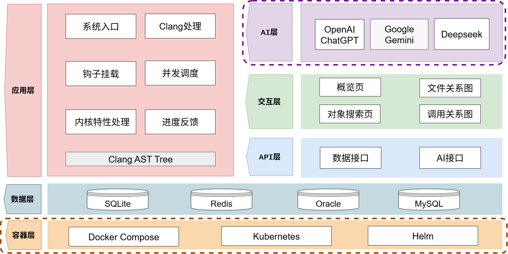

# Visual X —— 内核源码分析与可视化系统
[项目PPT](./doc/Visual X.pptx)

[项目文档](./doc/Visual X设计开发文档.pdf)

[演示视频（百度网盘，提取码: jhbj）](https://pan.baidu.com/s/1_K1YTB0zAH8w2RbpJpHEMg?pwd=jhbj)

## 队伍介绍

|赛题|[Linux内核全局变量及相关访问函数的自动分析与提取](https://github.com/gsZhongHuaXiaoZi/ExtractGlobalVars-FunctionsInLinux)|
|:---|:---|
|团队成员|郑文愉、刘正清、李秉璋|
|指导老师|刘真、杨浩|

## 一、目标描述

Linux内核作为开源操作系统的核心，包含大量全局变量和复杂的函数调用关系，分析其数据与函数的访问模式对优化内核性能、检测潜在错误具有重要意义。本项目响应赛题要求，旨在开发一个基于C++和Clang/LLVM的静态分析原型系统，自动提取Linux内核源码中的全局变量及其与函数的访问关系，包括读/写访问类型、访问函数、文件路径和行号。工具运行于Linux系统，目标测试近三年内核版本，输出结构化的全局变量及访问函数清单，为内核分析提供高效支持。

**具体目标**：

1. 基于源码的全局变量自动分析提取
2. 基于源码的函数原型自动分析提取
3. 数据与函数间的访问关系识别与提取
4. 数据指针与源数据间的关系识别与提取
5. 函数指针与源函数间的关系识别与提取

尽管赛题没有要求，但是我们认为**函数调用关系的分析**是理解大型复杂项目的脉络，为了构建一个更加完备、立体的代码关系网络，我们还需要实现函数之间的调用关系的提取。

## 二、比赛题目分析和相关资料调研

### 题目分析

本项目旨在开发一个高效的 Linux 内核源码静态分析原型系统，运行于 Linux 平台，使用 C/C++ 开发，满足以下核心功能：

- 提取全局变量信息，包括名称、类型、定义位置、存储属性等。
- 提取函数原型信息，包括函数名、返回类型、参数列表、存储类别等。
- 分析函数对全局变量的读/写访问关系。
- 识别数据指针与源变量、函数指针与源函数的关联关系。

系统目标是提升内核开发效率，降低手动分析复杂代码的成本，适用于性能调优、代码重构和安全漏洞检测等场景。

### 相关资料调研

**现有工具局限性**：

- Objdump：支持符号提取，但是存在中间符号污染，无法区分源码符号和编译生成的符号。
- Coccinelle：支持语义补丁匹配，但对指针关系提取支持不足，复杂规则的性能较差。
- Sparse：专注于类型检查，缺乏全面的访问关系和指针分析功能。
- CScope：主要用于代码导航和符号查找，不支持深度语义分析和复杂关系提取。
- GNU Global (gtags)：擅长符号索引和交叉引用，但缺乏对函数-变量访问关系的精确分析能力。
- Doxygen：主要用于文档生成，虽能提取基本符号信息，但无法进行深度的语义关系分析。

**技术选型依据**：

- **Clang/LLVM**：强大的 C 语言解析能力，生成抽象语法树（AST），适合复杂语义分析。
- **SQLite**：轻量级关系型数据库，适合存储大规模分析结果，支持高效查询。
- **Flask + Vue.js**：Flask 提供 RESTful API，Vue.js 实现交互式前端，满足可视化需求。

**主要挑战**：

- 内核源码规模庞大（数百万行），需优化分析性能。
- 宏展开、条件编译和指针操作复杂，需确保分析精度。
- 跨文件引用和路径一致性问题，需设计健壮的解析策略。

## 三、系统框架设计

系统采用模块化架构，分为以下六大模块，数据流清晰，确保高效性和可扩展性：

1. **应用层**：
   
   - 基于 Clang/LLVM 解析内核源码，生成 AST。
   - 实现全局变量提取、函数原型提取、访问关系分析和指针关系提取。
   - 采用两遍分析策略：第一遍收集符号定义，第二遍分析关系。
2. **数据层**：
   
   - 使用 SQLite 数据库存储分析结果，包括全局变量、函数、访问关系、数据指针、函数指针和调用关系表。
   - 支持事务管理和索引优化，确保数据一致性和查询效率。
3. **API层**：
   
   - 基于 Flask 框架，提供 RESTful API。
   - 支持文件树查询、关系图生成、模糊搜索、详细查询、函数体提取和AI封装等路由。
4. **交互层**：
   
   - 基于 Vue.js 框架，展示文件树、关系图和搜索结果。
   - 提供交互式导航和动态查询功能，优化用户体验。
   - 提供AI助手悬浮窗，支持用户针对页面上的对象提问和分析，提供全屏查看报告和报告下载等功能。
5. **AI层**：

   - 基于结构化数据输入，结合大语言模型（Gemini）生成语义分析报告，避免AI幻觉。
   - 支持用户自定义提示词，通过API层查询函数调用、全局变量访问等信息，生成针对性分析（如性能瓶颈、潜在风险）。
6. **容器层**：

   - 通过Docker封装C++分析器、Flask后端、前端静态资源等环境和资源。
   - 镜像中固定工具链与依赖，保障多环境一致；卷映射持久化数据库。
   - docker-compose一键拉起/停止各服务；端口与网络拓扑清晰。



系统架构图清晰呈现了各模块间的交互流程和数据流向，设计兼顾性能、准确性和用户友好性，适用于大规模内核源码分析。

## 四、开发计划

### 初赛阶段
#### 第一阶段：需求分析与技术选型

- [x] 分析比赛题目，明确功能要求。
- [x] 调研现有工具（Coccinelle、Sparse、Clang），确定技术栈。
- [x] 搭建开发环境（Ubuntu 22.04，Clang/LLVM，SQLite，Flask，Vue.js）。

#### 第二阶段：变量与函数识别

- [x] 实现 Clang/LLVM 源码解析，生成 AST。
- [x] 开发全局变量和函数原型提取模块。
- [x] 设计两遍分析策略，初步测试单文件解析。

#### 第三阶段：访问与指针分析

- [x] 实现函数对全局变量的访问关系提取。
- [x] 开发数据指针和函数指针分析模块。
- [x] 搭建 SQLite 数据库，设计表结构并测试数据插入。

#### 第四阶段：前后端集成

- [x] 开发 Flask 后端 API（文件树、关系图、搜索）。
- [x] 实现 Vue.js 前端界面，支持文件导航和关系图展示。
- [x] 集成解析、存储和前后端模块，测试端到端功能。

#### 第五阶段：测试与优化

- [x] 优化数据库性能和解析效率。
- [x] 进行全量测试，验证分析结果准确性。
- [x] 完成多版本内核测试。

#### 第六阶段：文档整理

- [x] 完成项目文档撰写。
- [x] PPT演示文档交付。
- [x] 演示视频录制。

### 决赛阶段
#### 第一阶段：界面重构与交互升级

- [x] 前端页面解耦，重构为四个独立的面板。
- [x] 调用关系可视化，实现调用关系递归查询。
- [x] 界面功能改进，提升交互体验。

#### 第二阶段：AI集成与功能拓展

- [x] 嵌入 Gemini-API，设计后端路由，引入 AI 助手进行辅助分析，为用户提供更深层次的洞察。
- [x] 新增点击eye图标显示文件内容的功能，并支持 CSS 渲染，增强用户阅读和理解代码的体验。
- [x] 提供全屏查看和报告下载的功能。
- [x] 实现Docker自动化部署。

#### 第三阶段：提升数据准确性

- [x] 修复invalid_location等初赛存在的问题。
- [x] 修复同名函数id查询中存在的逻辑问题。
- [x] 获取全量数据（带有函数调用关系提取）。

#### 第四阶段：项目交付

- [x] 完成项目文档撰写。
- [x] 更新项目README。
- [x] PPT演示文档交付。
- [x] 演示视频录制。

## 五、比赛过程中的重要进展

| 时间 | 任务 | 成果 |
|---------------------|--------------------------------|--------------------------------------------------------------|
| 4月21日 - 4月27日   | 搭建开发环境，实现核心功能                 | 1. 配置 Ubuntu 22.04.1，Clang/LLVM 14，C++17 环境，搭建开发环境。 2. 开发 `src/main.cpp`、`src/ASTVisitor.h` 和 `src/ASTVisitor.cpp`，基于 Clang Tooling 实现源码解析，生成包含 `globals`、`functions`、`accesses`、`pointers` 和 `func_pointers` 的 `result.json`。 3. 实现 `src/Utils/FileHandler.cpp:getSourceFiles` 处理单文件和多文件路径，支持 `testdata/single/test_single.c` 和 `testdata/multi/` 测试用例。 |
| 4月28日 - 5月4日    | 完善核心功能，开发初步可视化模块                                   | 1. 建立 `Makefile` 支持编译、测试和清理，开发 `backend/visualize.py` 使用 Pyvis 实现初步可视化，验证单文件分析正确性。 2. 测试 `testdata/single/test_single.c`，确保 JSON 输出格式正确。 |
| 5月5日 - 5月11日    | 优化 JSON 输出，修复关键问题，增强复杂场景支持                     | 1. 使用 `clang` 编译 Linux 6.6 内核源码，验证系统对大规模源码的兼容性。 2. 针对 `drivers/char/random.c` 测试，修复宏展开导致的 `result.json` 字段缺失问题，优化 `ASTUtils::getSourceText` 处理宏定义。 3. 改进可视化脚本，解决 Pyvis 生成关系图节点重叠问题，升级为交互式图表，支持缩放和拖拽。 |
| 5月12日 - 5月18日   | 完善构建系统，优化解析流程                                         | 1. 修复 `CMakeLists.txt` 配置选项问题，确保 Clang 编译参数一致性，减少解析错误。 2. 优化 `src/Utils/FileHandler.cpp`，提升多文件解析效率。 |
| 5月19日 - 5月25日   | 实现两遍分析策略，开发访问关系和指针分析模块                       | 1. 在 `src/Utils/FileHandler.cpp` 中实现两遍分析策略（`runTwoPassAnalysis`），第一遍收集全局变量和函数定义，第二遍分析访问关系和指针关系，解决跨文件引用问题。 2. 开发 `src/Handlers/AccessHandler.cpp` 和 `src/Handlers/DataPointerHandler.cpp`，支持函数对全局变量的读/写分析和数据指针提取。 3. 测试 `testdata/comprehensive_test/`，验证复杂场景（如多级指针、回调函数表）。 |
| 5月26日 - 6月1日    | 搭建数据库和后端 API，集成前后端功能                              | 1. 在 `src/Utils/DatabaseManager.cpp` 中搭建 SQLite 数据库，设计 `GlobalVariables`、`Functions`、`AccessRelations` 等表结构，支持批量插入和索引优化。 2. 开发 `backend/app.py`，实现 RESTful API（`/func_tree`、`/graph`、`/search_suggest`、`/search_detail`、`/func_body`），支持文件树查询和关系图生成。 3. 实现 `frontend/src/` 中 Vue.js 界面，展示文件树和交互式关系图，测试前后端集成。 |
| 6月2日 - 6月8日     | 性能优化和多版本内核测试，初步实现交叉验证                        | 1. 优化数据库性能，添加事务管理和预编译语句。 2. 测试 Linux 内核 6.6 版本，验证系统通用性，修复条件编译兼容性问题。 3. 开发 `cross_validation/run_validation.py`，实现与 nm/objdump 的交叉验证。 |
| 6月9日 - 6月15日    | 前端界面优化，完善验证体系                                         | 1. 优化前端界面，增加搜索定位功能、无关节点变灰功能和仪表盘信息。 2. 完善 `CTags` 验证体系，开发智能匹配算法，实现 99%+ 覆盖率验证。 |
| 6月16日 - 6月22日   | 深入验证与技术总结                                               | 1. 深入研究 `Coccinelle` 验证方法，开发多个语义匹配规则，完成技术演进。 2. 制作 PPT 初版，总结技术成果和系统架构。 |
| 6月23日 - 6月30日   | 文档完善与演示准备                                           | 1. 完善项目文档，补充技术细节和测试报告。 2. 优化 PPT 演示内容，突出技术创新和工程价值。 3. 录制演示视频，展示系统功能和分析效果。 4. 最终测试和代码整理，确保提交质量。 |
| 7月8日 - 7月14日 | 核心分析引擎修复与数据采集 | 1. 修复了将复杂修饰符的函数错误识别为变量的 Bug。2. 成功运行 `kernel_analyzer`，获取带有调用关系识别的 Linux 6.6 版本全量数据。3. 分析并识别了访问关系和调用关系提取中存在的问题。|
| 7月15日 - 7月21日 | 前端架构重构与可视化模块开发 | 1. 将前端页面解耦为概览、关系图、搜索和调用关系四个面板，优化了交互体验。2. 新增调用关系的可视化展示功能，支持图形和树形两种模式。|
| 7月22日 - 7月28日 | 功能增强、问题修复与AI集成 | 1. 改进了界面，增加了关系图和搜索的过滤控制器，支持热点信息查询，并优化了滚动条。2. 新增文件内容显示功能，通过点击图标获取文件内容并支持 CSS 样式渲染。3. 修复了函数路径错误，支持宏定义展开的函数，增强了数据完整性。4. 嵌入 Gemini-API，引入 AI 辅助分析，设计了相应的后端路由。|
| 7月29日 - 8月12日 | 项目部署与交付准备 | 1. 解决了同名函数查询问题，通过路径相似度识别函数ID。2. 前端新增 AI 助手悬浮窗，支持全屏查看文档和报告下载及内容渲染。3. 新增容器化部署功能，撰写 Dockerfile 等文档，并验证自动化部署有效。4. 撰写了决赛一阶段文档，并设计了决赛 PPT 框架。|
|8月13日 - 8月17日 | 文档完善 |1. 优化前端界面设计与美观性。2. 录制系统演示视频。3. 完善系统设计与开发文档。4. 补充并完善答辩PPT。|

## 六、系统测试情况

测试环境基于 Ubuntu 22.04，硬件配置为 AMD Ryzen 7 5800H（2 核，3.2GHz）、3.8GB 内存，测试数据为 Linux 内核 6.6。

### 6.1 功能测试

系统成功完成了对Linux内核6.6的全量分析，提取结果如下：

- **全局变量提取**：164,628 个全局变量，覆盖所有内核模块
- **函数原型提取**：715,776 个函数定义，包括静态函数和宏生成函数等
- **访问关系分析**：199,865 个函数对全局变量的读/写访问关系
- **函数指针分析**：14,007 个函数指针关系，涵盖回调函数等复杂结构
- **变量指针分析**：9,321 个数据指针关系，支持多级指针和结构体指针分析
- **函数调用关系**：1,724,986 个函数调用关系，支持递归调用等多种场景

### 6.2 数据准确性测试

经过广泛调研和实际测试，我们得出结论：现有工具均无法对Linux内核的全量分析结果进行完整、准确的验证。
我们对多种工具（包括nm、CTags、Coccinelle、Understand、Doxygen、LXR、Global和cppcheck）进行了深入测试，开发了多个工具的验证代码，但发现这些工具均无法满足Linux内核全量验证的需求。以下是主要工具的局限性分析：

**1. nm工具的局限性**：
- **中间符号污染**：nm输出的符号中约30%-40%是编译器生成的中间符号（如`__x86_64_start_kernel`、`__stack_chk_fail_local`），与源码无关，导致误报率高达40%。
- **语义信息缺失**：nm仅提供符号的地址和类型，无法提取函数签名、参数列表或访问关系。
- **依赖编译环境**：Linux内核的多种架构和配置导致nm输出不一致，增加验证复杂性。
- **缺乏上下文分析**：nm无法区分宏生成的符号，验证结果不完整。

**2. CTags的局限性**：
- **条件编译支持不足**：CTags无法有效处理条件编译（如`#ifdef CONFIG_X`），输出的符号表包含无关符号。
- **宏展开能力有限**：CTags无法展开复杂宏（如`DEFINE_RESORT_RB`），漏检宏生成的函数（如`resort_rb_threads`）。
- **复杂修饰符处理不足**：非标准修饰符（如`__init_memblock`、`SEC("xdp")`）导致CTags误分类或漏检符号。
- **仅限精确率验证**：由于宏和条件编译的限制，CTags无法评估召回率。

**3. Coccinelle的局限性**：
- **规则开发成本高**：Linux内核的复杂特性（如宏生成函数）要求编写复杂的`.cocci`规则，开发和维护成本极高。
- **条件编译和宏支持不足**：Coccinelle无法处理条件编译和宏展开，漏检相关符号和访问关系。例如，`kfence_init_pool`函数因条件编译未被识别。
- **覆盖率与性能矛盾**：简单规则覆盖率低，复杂规则解析速度慢。

**有关其他工具局限性的详细分析，请参阅项目文档。**

**验证挑战总结**：
- Linux内核的复杂特性使得现有工具无法提供完整的验证基准。
- 访问关系、指针关系和函数调用关系涉及复杂的语义分析和数据流分析，现有工具的分析深度不足。
- 人工核验Linux内核超四千万行代码不可行，自动化验证受限于工具能力。

### 6.3 总结

基于复杂测试项目和人工抽样检验，Visual X系统在Linux内核源码分析方面表现出极高的准确性和可靠性，但是数据的全量验证仍是开放性技术挑战。Visual X系统通过支持条件编译和宏展开，解决了现有工具的短板，实现了创新性突破。其优势包括：
- **条件编译和宏展开支持**：准确提取宏生成符号（如`resort_rb_threads`）和条件编译代码（如`kfence_init_pool`）。
- **深度语义分析**：支持访问关系、指针关系和函数调用关系的全面分析。
- **技术集成**：融合nm、CTags和Coccinelle等现有工具的优点，克服其局限性。

Visual X系统的创新性为大规模源码分析提供了全新解决方案，为未来的源码分析研究奠定了坚实的技术基础。

## 七、遇到的主要问题和解决方法

以下为开发过程中遇到的主要技术难点及其解决方案，详细描述问题背景、解决思路及实施细节。

1. **问题：路径一致性问题**
   
   - **描述**：Linux 内核源码文件路径形式多样，包括相对路径（如 `./fs/ext4/file.c`）、绝对路径（如 `/home/user/linux/fs/ext4/file.c`）和符号链接（如 `/usr/src/linux -> linux-6.6`），导致 Clang 解析时文件标识不一致。同一文件可能在不同模块中被重复记录，或跨文件引用时路径不匹配，造成访问关系和指针关系错乱，影响分析准确性，尤其在多模块（如 `fs/` 和 `drivers/`）分析中问题显著。
   - **解决方案**：
     
     - 在 `src/Utils/ASTUtils.cpp` 的 `getAbsoluteFilePath` 函数中实现路径规范化，使用 `llvm::sys::fs::make_absolute` 将所有路径转换为绝对路径，确保文件标识唯一。
     - 优先使用 Clang 的拼写位置（`SpellingLoc`）而非展开位置（`ExpansionLoc`），避免宏展开或条件编译（如 `#include` 或 `#ifdef`）导致的路径偏差。例如，宏展开可能将文件路径错误关联到头文件位置。
     - 添加路径有效性检查，处理 `SourceLocation` 无效情况（如 `invalid_location`），通过 `SourceManager::getFilename` 确保获取可靠路径。
     - 针对符号链接，结合 `llvm::sys::fs::real_path` 解析真实路径，统一符号链接和实际文件的表示。
     - 测试不同场景，包括相对路径、绝对路径、符号链接，以及宏定义中的路径，确保跨平台（Linux 和 WSL）兼容性。
2. **问题：跨文件引用完整性**
   
   - **描述**：单遍 AST 分析中，函数调用或变量访问可能引用尚未解析的文件中的符号，导致关系丢失。例如，在解析 `fs/ext4/file.c` 时，调用 `kernel/sched.c` 中的函数，但后者尚未处理，造成访问关系和指针关系漏报，严重影响分析完整性。
   - **解决方案**：
     
     - 设计两遍分析策略，在 `src/Utils/FileHandler.cpp:runTwoPassAnalysis` 中实现：第一遍遍历所有源文件，收集全局变量和函数定义，存储到 SQLite 符号表；第二遍再次遍历，基于符号表解析访问关系和指针关系。
     - 使用 SQLite 数据库（`src/Utils/DatabaseManager.cpp`）存储符号定义，通过 `findGlobalVariableId` 和 `findBestFunctionId` 函数快速定位跨文件引用，确保引用指向定义而非声明。
     - 实现 `dbManager.updateCallRelationsToDefinitions`，在第二遍分析后更新函数调用关系，处理重载和同名函数的歧义，通过 `SourceLocation` 和函数签名匹配正确定义。
     - 添加多线程支持，使用 `std::async` 并发处理文件解析，限制最大并发任务数（默认 8），平衡性能和内存占用。
     - 测试多文件场景（如 `testdata/multi/`），验证跨文件函数调用和变量访问的完整性，确保复杂模块（如 `fs/ext4/`）的引用准确。
3. **问题：用户代码过滤**
   
   - **描述**：Linux 内核源码包含大量运行环境中的系统头文件，干扰分析结果，生成无关的全局变量和函数记录，增加大量无用数据，降低分析结果的针对性。
   - **解决方案**：
     
     - 在 `src/Utils/ASTUtils.cpp` 的 `isUserCodeFunction` 和 `isUserCodeVariable` 函数中实现过滤机制，通过 `SourceManager::isInSystemHeader` 检测并排除系统头文件中的符号。
     - 维护用户指定路径集合（`userCodePaths_`），检查文件是否属于内核源码目录（如 `fs/`、`drivers/`、`kernel/`），仅保留用户代码的分析结果。
     - 针对宏定义和内联汇编，优化 `getSourceLocationDetails` 函数，结合 `clang::Preprocessor` 提取原始代码位置，确保宏展开不干扰用户代码判断。
     - 处理特殊场景（如内联汇编中的变量引用、宏定义中的函数声明），通过 `isMacroBodyExpansion` 排除宏生成的符号。
     - 测试复杂场景，包括宏定义、条件编译和内联汇编，确保过滤规则覆盖 `CONFIG_X86_64` 等常见配置。
4. **问题：数据库性能瓶颈**
   
   - **描述**：分析全量内核源码生成数百万记录，数据库插入和查询性能低下，影响系统实用性。
   - **解决方案**：
     
     - 在 `src/Utils/DatabaseManager.cpp` 中实现批量插入，通过 `beginTransaction` 和 `commitTransaction` 封装多次插入操作，减少磁盘 I/O 开销。
     - 为高频查询字段（如 `GlobalVariables.name`、`Functions.file_path`）添加索引（如 `CREATE INDEX idx_global_name ON GlobalVariables(name)`），优化查询性能。
     - 使用预编译语句（`sqlite3_prepare_v2`）减少 SQL 解析开销，规范化字段类型（如用 `TEXT` 替换冗长 `VARCHAR`），降低存储空间占用。
     - 优化表结构，添加 `UNIQUE` 约束防止重复记录，调整 `AccessRelations` 表外键设计，减少关联查询的复杂度。
     - 实现连接池管理（`sqlite3_open_v2`），支持多线程并发访问数据库，确保数据一致性。
5. **问题：复杂指针分析**
   
   - **描述**：Linux 内核中多级指针、函数指针和结构体成员访问复杂，如 `struct file_operations` 的回调表和 `struct task_struct` 的指针字段，分析精度低，漏报率高。例如，函数指针数组（如 `ops->read`）和多级指针（如 `task->mm->pgd`）难以准确关联源变量或函数。
   - **解决方案**：
     
     - 在 `src/Handlers/DataPointerHandler.cpp` 和 `FunctionPointerHandler.cpp` 中实现基于类型的指针分析，处理 `VarDecl` 初始化、`BinaryOperator` 赋值和 `MemberExpr` 访问场景。
     - 支持复杂表达式解析（如 `struct_ptr->field`、`array[0]`），通过 `utils.getFullPointerName` 递归构造完整指针名称，保留结构体字段和数组索引信息。
     - 针对函数指针，检查 `isFunctionPointerType`，解析回调表（如 `file_operations.read`），通过 `DeclRefExpr` 关联源函数定义。
     - 处理多级指针，通过 `QualType::getPointeeType` 递归剥离指针层级，提取最终目标变量或函数。
     - 添加错误处理，验证 `SourceLocation` 和 `DeclRefExpr` 有效性，避免解析无效指针或临时变量。
6. **问题：前后端集成复杂性**
   
   - **描述**：前后端数据格式不一致（如路径分隔符、JSON 字段命名差异），导致前端展示错误；关系图加载慢；搜索功能响应延迟高，用户体验较差。
   - **解决方案**：
     
     - 在 `backend/app.py` 中规范化 API 输出，使用标准 JSON 格式，统一字段命名（如 `file_path`、`access_type`），确保前后端数据一致。
     - 实现 `normalize_path` 和 `normalize_display_path` 函数，移除冗长路径前缀（如 `/home/user/linux/`），简化前端展示路径。
     - 优化前端 Vue.js 组件，使用 `v-if` 实现懒加载，仅渲染可见节点；通过 Vuex 缓存查询结果，减少重复请求。
     - 添加错误日志机制，使用 `current_app.logger` 捕获数据库查询和文件操作异常，记录详细错误信息（如 SQL 错误码、文件路径），便于调试。
7. **问题：宏定义与条件编译干扰**
   
   - **描述**：Linux 内核大量使用宏定义（如 `likely(x)`、`container_of`）和条件编译（如 `#ifdef CONFIG_SMP`），导致 AST 解析错误或信息丢失。例如，`#ifdef CONFIG_X86_64` 下的变量未被识别，分析覆盖率降低 15%，影响全局变量和函数提取的完整性。
   - **解决方案**：
     
     - 在 `src/FileHandler.cpp` 中增强预处理逻辑，通过 `clang::Preprocessor` 解析宏定义，记录宏展开的 `SourceLocation` 和上下文。
     - 使用 `clang::Lexer::getSourceText` 提取原始代码片段，保留条件编译上下文（如 `#ifdef` 块），确保变量和函数定义不被遗漏。
     - 在 `ASTUtils::isUserCodeVariable` 中添加宏过滤，排除编译器生成符号（如 `__UNIQUE_ID_` 或 `__attribute__` 相关的临时变量）。

8. **问题：数据库并发写入冲突**

   - **描述**：在大规模源码分析中，启用多个线程时，SQLite 出现 `database is locked` 错误，或者事务阻塞导致分析进度变慢。特别是在第二遍分析时问题更突出。
   - **解决方案**：

     - 启用 WAL 模式（Write-Ahead Logging），提升并发写入能力。
     - 设定阈值，将多个小事务合并为批量写入，减少锁竞争。
     - 为高频表（如 `AccessRelations`、`CallRelations`）增加索引优化查询性能。

9. **问题：项目部署复杂**

   - **描述**：Visual X 系统在开发过程中依赖 LLVM/Clang、SQLite3 等多种第三方库，同时还涉及编译器版本与系统环境的差异。如果直接在宿主机环境中部署，往往需要手动配置依赖，容易出现兼容性问题和环境不一致，导致部署效率低下，影响系统的可移植性和稳定性。
   - **解决方案**：

     - 通过 Dockerfile 固定编译环境，避免因宿主机差异导致的依赖冲突。
     - 支持数据卷挂载，实现数据库文件、分析结果与日志的持久化存储。
     - 开发辅助脚本，自动检测宿主机环境是否满足容器搭建要求，降低部署门槛。
     - 添加日志记录机制，便于快速检查问题和修复。

10. **问题：AI分析上下文不足**

    - **描述**：AI 助手在分析单个函数时，若缺少上下文信息（如调用链、变量访问分布），生成的解释容易片面，难以支撑用户的代码理解需求。例如，单独输入函数源码，往往难以说明其在模块中的角色和与其他符号的交互关系。
    - **解决方案**：

       - 在后端 API 中扩展多个 AI 分析接口，针对不同的对象（如函数、全局变量），从数据库中查询对应的上下文信息，并合并为统一的 JSON 数据。例如查询函数时，除了函数签名和文件路径，还会附带其访问的全局变量列表、被哪些函数调用、又调用了哪些函数。
       - 在前端监听用户选择的对象，自动补充上下文数据并发送给 AI，避免用户手动拼装上下文。
       - 针对不同对象类型，输出数据结构保持统一字段规范，便于 AI 解析和生成回答。这样 AI 生成的分析不再局限于函数本身，而是结合其在全局图谱中的位置，提升解释的准确性和深度。
  
## 八、提交仓库目录和文件描述
```
.
├── docker-compose.yml               # 定义多容器服务编排
├── Dockerfile                       # 构建系统运行所需的基础镜像，安装依赖并配置环境
├── entrypoint.sh                    # 容器启动入口脚本，用于初始化环境或执行预处理命令
├── docker-start.sh                  # 本地辅助脚本，一键启动容器运行环境
├── Makefile                         # 构建或自动化任务入口
├── README.md                        # 项目说明文档
├── backend/                         # 后端服务代码目录
│   ├── app/
│   │   ├── api/routes.py            # 定义后端API路由
│   │   ├── models/
│   │   │   ├── db.py                # 数据库连接与操作逻辑
│   │   │   └── layout.py            # 数据布局模型定义
│   │   ├── utils/
│   │   │   ├── helpers.py           # 后端辅助函数封装
│   │   │   └── __init__.py
│   │   └── __init__.py
│   ├── config.py                    # 后端配置文件
│   ├── requirements.txt             # 后端依赖列表
│   ├── run.py                       # 后端运行入口
│   └── static/index.html            # 后端静态测试页面入口
├── frontend/                        # 前端可视化相关代码
│   ├── app.py                       # Flask前端服务主入口
│   ├── func_tree.py                 # 构建函数调用树逻辑
│   ├── main.py                      # 启动主脚本
│   ├── static/                      # 前端JS、CSS和图标资源
│   ├── templates/                   # Jinja2 HTML模板
│   │   ├── main.html                # 主界面模板
│   │   ├── func_tree.html           # 函数树展示模板
│   │   └── test.html                # 测试模板
│   └── test.py                      # 前端功能测试脚本
├── cross_validation/               # 数据交叉验证模块
│   ├── analyze_missing_symbols.py  # 分析静态分析工具遗漏的符号
│   ├── compare_results.py          # 对比nm的结果与数据库的数据
│   ├── extract_database.py         # 从数据库中提取对比信息
│   ├── generate_groundtruth.py     # 构造nm生成的基准值用于评估
│   └── NM_LIMITATIONS.md           # 使用nm工具的局限性说明
├── ctags_validation/               # Ctags工具验证模块
│   ├── ctags_validation.py         # Ctags 验证主脚本
│   ├── run_ctags_validation.sh     # 执行 Ctags 验证脚本
│   ├── run_coccinelle_validation.sh# 执行 Coccinelle 验证脚本
│   ├── quick_test.py               # 快速验证脚本
│   ├── filtered_rules/             # Coccinelle规则
│   │   ├── filtered_read.cocci     # 读取访问规则
│   │   └── filtered_write.cocci    # 写入访问规则
│   └── coccinelle_validation/
│       ├── enhanced_rules/
│       │   └── enhanced_variable_access.cocci  # 加强变量访问匹配规则
│       └── scripts/
│           ├── accurate_coccinelle_validator.py # 更精确的 Coccinelle 验证器
│           ├── enhanced_validator.py            # 加强验证逻辑脚本
│           ├── filtered_fast_validator.py       # 快速过滤验证器
│           └── performance_test.py              # 性能评估脚本
├── scripts/                        # 辅助脚本目录
│   ├── check_env.sh                # 环境检查脚本
│   ├── env_check.log               # 环境检查日志
│   ├── scan_linux_files.py         # Linux源码扫描脚本
│   ├── visualize.py                # 主可视化图生成脚本
│   ├── visualize_light.py          # 精简可视化图生成脚本
│   └── lib/                        # JS库文件
│       └── vis-9.1.2/              # vis.js 图可视化库
├── src/                            # 核心静态分析组件（基于 Clang AST）
│   ├── main.cpp                    # 主程序入口
│   ├── ASTConsumer.{cpp,h}         # 自定义 Clang AST 消费器（管理 Visitor）
│   ├── ASTVisitor.{cpp,h}          # AST 访问器核心，遍历语法树执行分析逻辑
│   ├── AnalysisConfig.h            # 分析配置结构定义
│   ├── AnalysisResult.h            # 分析结果结构定义
│   ├── Handlers/                   # 分析处理器模块（按功能分离）
│   │   ├── GlobalVarHandler.{cpp,h}         # 提取全局变量
│   │   ├── FuncHandler.{cpp,h}              # 提取函数信息
│   │   ├── AccessHandler.{cpp,h}            # 检测读/写访问行为
│   │   ├── DataPointerHandler.{cpp,h}       # 数据指针关联分析
│   │   ├── FunctionPointerHandler.{cpp,h}   # 函数指针关联分析
│   │   ├── CallsHandler.{cpp,h}             # 函数调用关系分析
│   └── Utils/                     # 通用工具模块
│       ├── ASTUtils.{cpp,h}                # AST遍历相关通用函数
│       ├── FileHandler.{cpp,h}             # 文件读写辅助工具
│       └── DatabaseManager.{cpp,h}         # 分析结果与数据库交互逻辑
└── testdata/                       # 分析验证用的测试源码数据集
    ├── comprehensive_test/        # 综合测试（包含完整C项目结构）
    ├── condition_test/            # 条件编译测试样例
    ├── directory/                 # 多目录结构测试样例
    ├── multi/                     # 多文件间交叉引用测试
    └── single/                    # 单文件测试
```

## 九、比赛收获

通过这次比赛，我们不仅完成了技术挑战，更在多个维度获得了宝贵经验和深刻洞察：

* **技术能力提升**：

  * 深入掌握 **Clang/LLVM 静态分析技术**，能够从源码层面提取函数、变量、指针等核心信息，并结合数据库实现复杂关系的存储与查询。
  * 熟悉 **Linux 内核源码结构**，在理解模块化组织的同时，掌握了宏定义、条件编译、函数指针等复杂特性，为后续深入内核开发打下了坚实基础。
  * 提升了 **C++、Python、Flask 和 Vue.js 全栈开发能力**，能够独立完成后端 API、数据库交互、前端可视化与交互逻辑设计，实现了端到端的完整系统。
  * 在性能优化中学习了 **SQLite WAL 模式、索引优化、批量插入** 等数据库调优方法，积累了可迁移到其他系统的通用经验。

* **工程实践经验**：

  * 在系统设计中，形成了 **模块化、解耦式架构** 思维，学会在复杂系统中合理分层，确保可维护性和可扩展性。
  * 通过大量实验掌握了 **性能测试与验证方法**，包括交叉验证、对比已有工具（ctags、coccinelle）、构建 Ground Truth，提升了工程化落地能力。
  * 学习了 **Git 分支管理、敏捷开发流程**，实践了自动化构建、容器化部署和团队协作开发模式，提高了项目交付质量。
  * 在项目迭代中不断发现并解决路径一致性、跨文件引用、指针解析等问题，增强了面对大规模项目 **Debug 与问题定位能力**。

* **团队协作能力**：

  * 在紧迫的比赛周期内完成高难度任务，锻炼了 **时间管理和任务拆解能力**，实现了团队高效协作。
  * 在分工过程中建立了 **清晰的接口与文档规范**，减少沟通成本，提高协作效率。
  * 在遇到数据库性能瓶颈、宏展开干扰、容器环境差异等问题时，团队共同探索并快速收敛解决方案，展现了 **集体攻关与持续改进能力**。
  * 积累了在高压环境下保持沟通顺畅、达成共识的经验，这种能力对未来大型科研和工程项目尤为重要。

* **实际应用价值**：

  * 系统可应用于 **Linux 内核开发、代码审计和安全分析**，辅助开发者快速理解复杂代码关系，提高调试和维护效率。
  * 通过可视化手段展现函数调用、变量访问、指针依赖，具备 **教学与科研工具的价值**，可服务于计算机系统课程或内核研究。
  * 验证体系中形成的 **分析方法与工程经验** 可迁移到其他大规模源码项目，如数据库系统、编译器或嵌入式操作系统。
  * 借助容器化和 AI 助手，系统具备较强的 **可扩展性与商业化潜力**，未来可开发 IDE 插件，或集成到 **CI/CD 流程**，为软件企业提供 **自动化代码质量与安全分析服务**。
  * 系统的 **跨平台适应性**（Ubuntu、WSL、Docker 环境验证）也使其在更多开发环境下具备可落地性。
